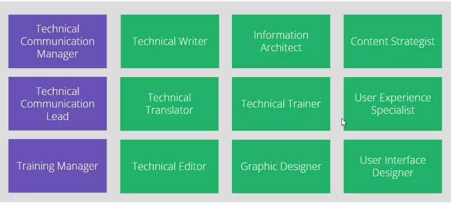

ITCQF TRAINING NOTES - DAY 1

# Table of Contents: <!-- omit in toc --> 
- [Important links](#important-links)
- [Types of technical communication](#types-of-technical-communication)
- [Business value of technical communication](#business-value-of-technical-communication)
  - [Benefits:](#benefits)
  - [Risks:](#risks)
- [Information lifecycle](#information-lifecycle)
- [The psychology of technical communication](#the-psychology-of-technical-communication)
- [Code of ethics as defined by ITCQF](#code-of-ethics-as-defined-by-itcqf)
- [Career paths in technical communication](#career-paths-in-technical-communication)
- [Types of technical communication deliverables](#types-of-technical-communication-deliverables)
- [Product documentation](#product-documentation)
  - [User Guides (User Manuals)](#user-guides-user-manuals)
  - [Online help](#online-help)
  - [Mobile Application Help](#mobile-application-help)
  - [Knowledge Bases](#knowledge-bases)
  - [Release Notes](#release-notes)
  - [API documentation](#api-documentation)
  - [Summary](#summary)
- [Training Materials](#training-materials)
  - [Presentations](#presentations)
  - [Classroom trainings](#classroom-trainings)
  - [E-learning](#e-learning)
  - [Webinars](#webinars)
  - [Summary](#summary-1)
- [Process Documentation](#process-documentation)
  - [Project documentation](#project-documentation)
  - [Policies and procedures](#policies-and-procedures)
  - [Reports](#reports)
  - [Summary](#summary-2)
- [Content creation process](#content-creation-process)

# Important links
https://itcqf.org/materials/ (Syllabus)

https://www.gasq.org/en/certification/online-at-home-exams.html

http://edu.ittraining.pl/egzamin/ITCQF-Certified-Technical-Communication-Professional-Foundation-Level

# Types of technical communication

* Technical writing
* Technical editing
* Graphic design
* UI design
* Information architecture
* Technical translation
* Technical training
* UX Usability

# Business value of technical communication

## Benefits:

>Organization : Well-documented product, comprehensive training materials, established processes, standards and responsibilities

>Employees: Better understanding of the product, faster implementation, ease of support for the customers, share knowledge

>Business: Reduced cost of implementation and support, improved customer satisfaction, reusable content for marketing

## Risks:

>Organization: Incomplete/lack of documentation, Unstructured, ad-hoc trainings, created on demand, not updated regularly

>Employees: Discovering the wheel over and over again, difficult introduction of newcomers, only 'gurus' can resolve issues, knowledge silos

>Business: High and unpredictable cost of implementation and support, customer dissatisfaction, dangerous legal and life consequences

# Information lifecycle

Plan -> Research -> Design -> Develop -> Review -> Publish -> Maintain -> Discard -> Plan...

(In theory - in practice, it's usually a huge mess.)

>[!CAUTION]
>**ITCQF says that documentation is not indispensible to release a product**

# The psychology of technical communication

Soft skills - communication, teamwork, empathy

Technical skills - intermediary between expert and end-users

Mindset - curiosity, patience, consistency

# Code of ethics as defined by ITCQF

Loyalty - public interest, clients, employers, co-workers

Quality - standards and product (speak up if something is wrong with the product)

Community - reputation, knowledge sharing (Tech writing community!)

Professionalism - independence and respect (Don't settle for half-measures)

Education - for others and ourselves

# Career paths in technical communication

>[!TIP]
>Lead vs manager as defined by ITCQF - The lead, as the head of a tech writing team, reports to the manager.

# Types of technical communication deliverables

* Product documentation
* Training materials
* Process documentation

# Product documentation
Deals with user assistance related to products, including installation, usage, maintenance, customization etc.

Types of prod docs:
* User Guides
* Online Help
* Mobile App Help
* Knowledge Bases
* Release Notes
* API Documentation

## User Guides (User Manuals)
Designed to provide assistance for a particular aspect of a product or solution

Universal - not limited to a single industry; suitable for end users as well as expert-level readers
### Purpose <!-- omit in toc -->
* Administration guides
* How-to guides
* Implementation guides
* Installation guides
* Quick start guides
* Technical guides
### Audience <!-- omit in toc -->
* System administrators
* End users
* Technical staff - e.g. professional services
* First-time users
* Other types
### Structure <!-- omit in toc -->
1. Book-like structure - chapters
2. Table of contents
3. Images and diagrams
4. References
5. Glossary
6. Index
### Publishing <!-- omit in toc -->
* Hardcopy
* Printable format eg. PDF
* Used as printed book or electronic version

### Examples: <!-- omit in toc -->

[Iphone user guide](https://manuals.info.apple.com/MANUALS/1000/MA1565/en_US/iphone_user_guide.pdf)

## Online help
Known also as an OH, Help Files, F1 Help.

Designed to be displayed on the screen for immediate assistance when using IT products.

### Purpose <!-- omit in toc -->
* Quick and direct assistance
* Accessible
* Context and state aware
### Audience <!-- omit in toc -->
* Beginners (simple guidance)
* Frequent users (advanced options)
* Experts (as a reference)
### Structure <!-- omit in toc -->
1. Tree structure
2. Cross-references
3. Search
4. Table of contents
5. Index
### Publishing <!-- omit in toc -->
* Presented on the screen
* Invoked from the application - chapters linked to particular screens
* Not meant to be printed
* Interactive format (eg. HTML)
### Examples <!-- omit in toc -->
* Windows explorer
* MS Office
* MaCap Flare - dynamic help

## Mobile Application Help

* Smartphones
* Tablets
* E-book readers
* Embedded soft

### Purpose <!-- omit in toc -->
* Instant access
* Device-specific screen size
* Easy navigation
### Audience <!-- omit in toc -->
* Gamers
* Business users
* General consumers
* Kids
### Structure <!-- omit in toc -->
* Simplified and limited online help
* FAQ
* One or only a few pages
* Link to an external web page
### Publishing <!-- omit in toc -->
* Embedded in the app (e.g. HTML or one of the screens)
* External webpage
### Examples <!-- omit in toc -->
* Strava
* mBank
* Booking
* Chrome

## Knowledge Bases
1. Web-based system
2. **Gathers many different types of information about a product**
3. Other types of product documentation **can** be included (can include a PDF file embedded in a webpage...)
4. Searchable
5. **Can** build a user community
### Purpose <!-- omit in toc -->
* Gathers all available knowledge in one place
* Handles large quantities of documents
* One place for different types of content
### Audience <!-- omit in toc -->
Open for everyone:
* who uses a product (access may be restricted)
* in different ways (customers, partners, employees)
### Structure <!-- omit in toc -->
* Usually a web portal with various subsections:
* Manuals/guides 
* Articles
* Tutorials/FAQs
* Forums
* Downloads
* ...
### Publishing <!-- omit in toc -->
* Internet
* Intranet
* Multiple authors
* Collaboration tools (forums)
* Feedback tools (comments, rankings)
### Examples <!-- omit in toc -->
* [Microsoft Support](https://support.microsoft.com)
* [IBM Knowledge Center](https://www.ibm.com/docs/en/)
* Slack
* Apple

## Release Notes
* Change overview
* **Product version-specific**
* High-level
### Purpose <!-- omit in toc -->
* **List of changes in a particular product version**
* First document to be read before installation or upgrade
### Audience <!-- omit in toc -->
* Administrators
* Implementers
* Testers
* Customers
### Structure <!-- omit in toc -->
* Short document
* Product version identification
* Short intro
* New features
* Fixes
* Known issues
* Manual operations
### Publishing <!-- omit in toc -->
* Separate document
* Embedded in software product (eg. popup)
* Simple form (txt, pdf, html)

### Examples <!-- omit in toc -->
* [Atlassian Confluence](https://confluence.atlassian.com/doc/confluence-release-notes-327.html)
* [Slack](https://slack.com/release-notes/windows)
* [Airtable](https://www.airtable.com/whatsnew)

## API documentation
* Web-based
* Reference on API endpoints
* Tutorials and example scenarios
### Purpose <!-- omit in toc -->
* Explain an API's functionality and business value
* Provide a quick reference for developers
### Audience <!-- omit in toc -->
* Developers
* Decision-makers
### Structure <!-- omit in toc -->
* Web-based format
* Endpoint reference
* Tutorials
* Use cases
* Interactive
### Publishing <!-- omit in toc -->
* Produced from code
* Automated build process
### Examples <!-- omit in toc -->
* [OpenWeatherMap](https://openweathermap.org/api)
* [Spotify](https://developer.spotify.com/documentation/web-api)
* [GitHub Rest API](https://docs.github.com/rest)
* [Graph API (Facebook)](https://developers.facebook.com/docs/graph-api/)
* [Allegro developer portal](https://developer.allegro.pl/)

## Summary

|Type |Purpose |Audience |Structure | Publishing |
|-|-|-|-|-|
|User Guide|Administration, Installation, Implementation, How-to| Administrators, Technical Staff, Users | Book-like | PDF, Printed|
|Online Help| Quick, direct, context-aware assistance | End users| Tree, Hypertext, Searchable| HTML, F1|
|Mobile App Help| Instant access, Adjusted to device| End users| Few screens, navigation|Embedded, link to webpage|
|Knowledge base|One place to gather all content|Everybody|Web portal| Internet, Intranet|
|Release notes|Changes in new version|Technical staff, technical users | short document |TXT, PDF, HTML, Separate or embedded|
|API Documentation| How to use an API| Developers, Decision-makers|Endpoint reference, Tutorials|Webpage, Built from code|

# Training Materials
Technical communication deliverables used for facilitating the learning process

## Presentations
* Training or informative materials
* Slideshow
* Used by a lecturer/presenter/trainer

### Purpose <!-- omit in toc -->
* Reference during training sessions
* Information on particular subject
* Help trainer and trainee to visualise and understand

### Audience <!-- omit in toc -->
* Trainers
* Trainees
  * End users
  * Customers
  * Partners
  * Other
  
### Structure <!-- omit in toc -->
* Text
* Images
* Animations
* Audio
* Video

### Publishing <!-- omit in toc -->
* Displayed by the presenter
  
### Examples <!-- omit in toc -->
## Classroom trainings
* Training materials for in-class training
* Product-oriented education and marketing
* Live usage of the product
* Presentations + textbooks + labs

### Purpose <!-- omit in toc -->
* Teaching
* Theory and practical skills
* Interaction
* Group work
* 
### Audience <!-- omit in toc -->
* Trainers
* Trainees
  * End users
  * Technical staff
* Pre-defined skills level
* Prerequisites (optional)

### Structure <!-- omit in toc -->
* Presentation
* Textbook
* Exercises/laboratories
* Quizzes
* Pre- and post-training surveys
* Certificates

### Publishing <!-- omit in toc -->
* Package covering a set of presentations
* Training environment
* Printed or electronic textbooks
* Accompanying documents

### Examples <!-- omit in toc -->

* Quizzes
* Games
* Exercises
* Labs
* Accessories
* Discussions

## E-learning
* Training without a trainer
* Materials for self- or remote-learning
* Educational courses
* Accessible via the Internet or from physical media

### Purpose <!-- omit in toc -->
* Teaching
* Theory and practical skills
* Less expensive than classroom training
* Highly accessible

### Audience <!-- omit in toc -->
* Trainers
* Trainees
  * End users
  * Technical staff
  * Students
* Pre-defined skills level
* Prerequisites (optional)

### Structure <!-- omit in toc -->
* Presentation
* Recorded trainer narration
* Divided into chapters/sections
* Exercises
* Quizzes
* Pre- and post-training surveys
* Certificates

### Publishing <!-- omit in toc -->
* Online
* Physical media
* **Predefined order**

### Examples <!-- omit in toc -->
* Microsoft Virtual Academy
* edX
* Codeacademy
* Khan Academy
* Lynda.com
* SoloLearn

## Webinars
* Online sessions
* Small group of people
* Focused on one topic
* **Bi-directional communication between trainees and trainer(s)**

### Purpose <!-- omit in toc -->
* Teaching and/or clarification
* Explanation of difficult topics
* Demo purposes
* Business contacts

### Audience <!-- omit in toc -->
* Trainees
* Customers
  * Current
  * Prospect
* Business partners

### Structure <!-- omit in toc -->
* Online lecture
* Presentation
* **Demo session**
* **Desktop sharing**
* Tests & Quizzes
* Pre- and post-training surveys
* Certificates

### Publishing <!-- omit in toc -->
* Online
* Specialized tools
* Recorded for future reuse*

### Examples <!-- omit in toc -->
* Recorded webinar: soap!
* MadCap - free live webinars
* MadCap - free recorded webinars
* GoToWebinar
* Citrix Collaboration and Communication Products
* Webinars OnAir
* Cisco WebEx

## Summary

|Type |Purpose |Audience |Structure | Publishing |
|-|-|-|-|-|
|Presentations|Trainers reference, information on particular subjects| Trainers, Trainees | Slides, screens | PPT, PDF, Html, Printed|
|Classroom trainings| Presentations + live usage of the product + exercises + labs | Trainers, Trainees|Presentation, Textbook, Exercises/Labs, Quizzes, Surveys, Certificates|PPT, HTML, PDF... Printed, Test environment, Doc, PDF|
|E-learning| Less expensive than in-class training, highly accessible| Trainers, Trainees|Presentation recording, Exercises/Labs, Quizzes, Surveys, Certificates| On-line, CD/DVD/ Predefined order|
|Webinar|Explanation,Clarification, demo, marketing contacts|Trainees, Customers, Partners| Presentation, Recording, Demo, Quizzes, Surveys|On-line live, On-line recorded|

# Process Documentation
Technical communication deliverables used for systematizing or monitoring a series of actions that lead to achieving a certain goal.

## Project documentation
* Project proposals, business cases, feasibility studies
* Specifications - requirements, design
* Plans - project or its specific part/phase
* Required to complete project
* Formally approved or reviewed

### Purpose <!-- omit in toc -->
* To plan, execute, track and complete the project
* Establish common language and understanding
* **Written evidence**
* Input for subsequent projects
  
### Audience <!-- omit in toc -->
* Project stakeholders
  * Team members
  * Management
  * Decision makers

### Structure <!-- omit in toc -->
* Book-like structure - cover page, contents, chapters, ...
* Introduction
* Objectives
* Problem statement
* Problem solution
* Specific (management/technical) sections
* Approvals

### Publishing <!-- omit in toc -->
* Published in electronic form
* Printable format (DOC, PDF, XLS)
* Templates

### Examples <!-- omit in toc -->

## Policies and procedures

* Official documents
* Process descriptions
* Rules
* Principles
* Guidelines
* Specific to an organisation

### Purpose <!-- omit in toc -->
* Common processes
* Quality management
* Repeatability
* Reference for employees

### Audience <!-- omit in toc -->
* Team members
* Employees
* Auditors

### Structure <!-- omit in toc -->
* Images and diagrams
* References
* Glossary
* Table of contents
* Index
* Approvals
* Revision history

### Publishing <!-- omit in toc -->
* Published in electronic form (PDF, DOC, HTML, Wiki pages, Diagrams)
* Printable
* Available in Intranet
* Sometimes delivered as a hardcopy

### Examples <!-- omit in toc -->
* [Quality Manual](https://canaltaflow.com/wp-content/uploads/2021/10/ISO-Manual-1.pdf)
* [Standard Operating Procedure (SOP)](https://www.nj.gov/agriculture/pdf/HACCPsop.pdf)

## Reports
A report is an analytical document written to provide data on a particular subject to a
specific audience. 

* Particular subject
* Specific audience
* Based on data and facts
* Summary

### Purpose <!-- omit in toc -->
* Analysis
* Periodic or on demand status update
* Input for decisions
  
### Audience <!-- omit in toc -->
* Managers
* People responsible for specific organization areas or tasks
* Decision makers
* Analysts
* 
### Structure <!-- omit in toc -->
* Various options possible
* Automated or manually created
* **Must be adjusted to purpose and audience!**
* "Historical" data must be included
  * Author
  * Version
  * Approval (optional)
  * Date

### Publishing <!-- omit in toc -->
* Depending on the receiver:
  * PDF, DOC, HTML
  * PPT, XLS
  * Printed

### Examples <!-- omit in toc -->
* [Information is Beautiful](https://informationisbeautiful.net/)
* [Sample Market Research](https://4newideas.com/pdf/Sample%20Market%20Research.pdf)

## Summary

|Type |Purpose |Audience |Structure | Publishing |
|-|-|-|-|-|
|Project documentation| Planning, execution, tracking, completion of the project| Project team members & stakeholders| Book-like| PDF, DOC, XLS, ... Printed|
|Policies and procedures|Process description, Organization, Training|Employees|Formal guide|PDF, DOC, HTML, Wiki pages, Diagrams, ... Printed, Intranet|
|Reports|Input for decisions and planning| Managers, Analysts| Depending on the needs| PDF, DOC, HTML, PPT, XLS, ... Printed, On-line|

# Content creation process

TBC...
